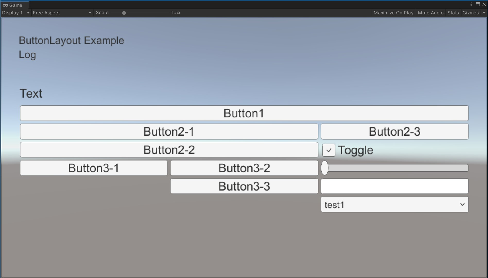

# ButtonLayout

## 説明

実機デバッグのUI構築用



``` C#:Example
using System.Collections;
using System.Collections.Generic;
using UnityEngine;
using UnityEngine.UI;
using UnityEngine.EventSystems;
using System.Linq;

using BTL;

namespace testapp
{
    public class TestApp : MonoBehaviour
    {
        [SerializeField]
        Text textTitle = null;

        [SerializeField]
        Text textLog = null;

        [SerializeField]
        ButtonLayoutResources resources;

        ButtonLayoutManager layoutManager;

        public void Start()
        {
            textTitle.text = "ButtonLayout Example";

            layoutManager = new ButtonLayoutManager(resources);

            using (new BTLBuilder(layoutManager)) {

                new BTLText("Text");
                var firstButton = new BTLButton("Button1", onClick).button;

                using (new BTLHorizontal()) {
                    using (new BTLVertical()) {
                        new BTLButton("Button2-1", onClick);
                        new BTLButton("Button2-2", onClick);

                        using (new BTLHorizontal()) {
                            using (new BTLVertical()) {
                                new BTLButton("Button3-1", onClick);
   
                            }
                            using (new BTLVertical()) {
                                new BTLButton("Button3-2", onClick);
                                new BTLButton("Button3-3", onClick);
                            }
                        }
                    }
                    using (new BTLVertical()) {
                        new BTLButton("Button2-3", onClick);
                        new BTLToggle("Toggle", onValueChanged);
                        new BTLSlider("Slider", onValueChanged);
                        new BTLInputField("Inputfield", onValueChanged);
                        new BTLDropdown("Dropdown", onValueChanged, 0, new List<string>() { "test1", "test2" });
                    }
                }

                EventSystem.current.SetSelectedGameObject(firstButton.gameObject);
            }
        }

        private void Update()
        {
            layoutManager.UpdateLayout();
        }

        void onClick(Button sender) => textLog.text = sender.name;
        void onValueChanged(Toggle sender, bool ret) => textLog.text = $"{sender.name}:{ret}";
        void onValueChanged(Slider sender, float ret) => textLog.text = $"{sender.name}:{ret}";
        void onValueChanged(InputField sender, string ret) => textLog.text = $"{sender.name}:{ret}";
        void onValueChanged(Dropdown sender, int ret) => textLog.text = $"{sender.name}:{ret}";
    }
}


```

